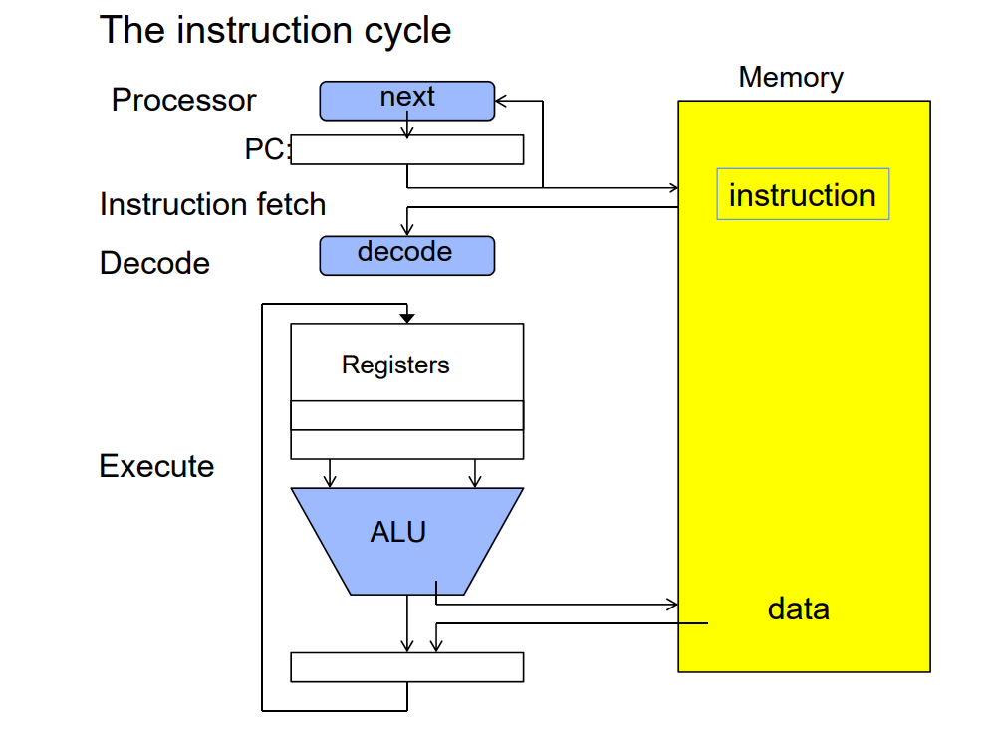
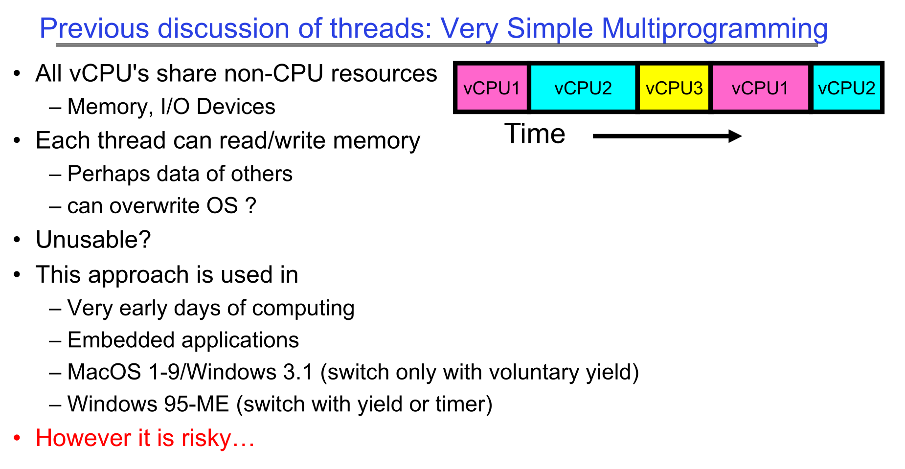
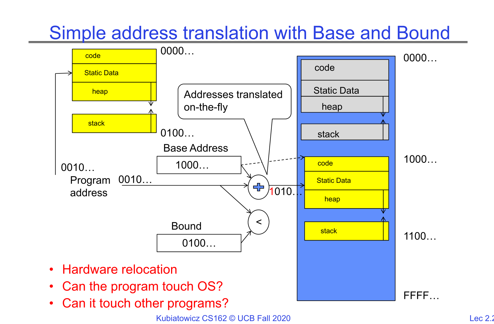
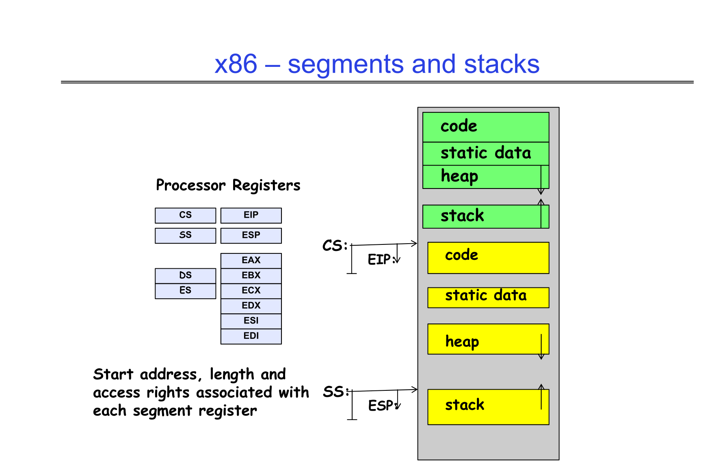

### Summary

Thread: Execution Context

- Fully describes program state
- Program Counter, Registers, Execution Flags, Stack

Address space (with or w/o translation)

- Set of memory addresses accessible to program (for read or write)
- May be distinct from memory space of the physical machine (in which case programs operate in a virtual address space)

Process: an instance of a running program

- Protected Address Space + One or more Threads

Dual mode operation / Protection

- Only the "system" has the ability to access certain resources
- Combined with translation, isolates programs from each other and the OS from programs

### Thread: Logical sequence of instructions

Thread 是对 Processor 的抽象

指令循环：

1. Fetch PC 指向的指令
2. decode 指令
3. ALU 执行运算
4. 写回内存/REG，更新 PC
5. 重复这一循环

**线程** 就是对这一切的 Abstraction： PC， regs， Execution Flags（执行标志），栈堆空间，内存状态……

??? note "Execution Flags"
    在 x86 架构中，处理器的当前状态和算术逻辑运算的结果通过一个称为 **EFLAGS 寄存器** 的特殊寄存器来记录。 这个寄存器里的每一个位（bit）就是一个标志（flag），它们控制着程序的执行流程或表明特定操作的结果。

    #### 状态标志 (Status Flags)

    这些标志主要由算术指令（如 ADD, SUB, CMP）自动设置，用于反映上一个操作的结果。

    - **ZF (Zero Flag - 零标志):** 如果运算结果为零，则设置为 1。
    - **SF (Sign Flag - 符号标志):** 如果运算结果为负数（即最高位为1），则设置为 1。
    - **OF (Overflow Flag - 溢出标志):** 如果有符号数运算的结果超出了目标操作数的位数范围（发生溢出），则设置为 1。
    - **CF (Carry Flag - 进位标志):** 如果无符号数运算产生进位（加法）或借位（减法），则设置为 1。
    - **PF (Parity Flag - 奇偶标志):** 如果运算结果的最低有效字节中“1”的个数为偶数，则设置为 1。
    - **AF (Auxiliary Carry Flag - 辅助进位标志):** 如果从第3位到第4位发生进位或借位（用于BCD码算术），则设置为 1。

    #### 控制标志 (Control Flags)

    这些标志用于控制 CPU 的某些特定操作。

    - **DF (Direction Flag - 方向标志):** 控制字符串操作指令（如 MOVS, CMPS）处理内存地址时的方向。
        ***DF = 0:** 地址递增。
      - **DF = 1:** 地址递减。
    - **IF (Interrupt Enable Flag - 中断允许标志):** 控制 CPU 是否响应可屏蔽的外部硬件中断。
        ***IF = 1:** 允许中断。
      - **IF = 0:** 忽略中断。

一个线程由一个 CPU 的物理核心运作。（一般一个 core 跑一个 thread。现在的超线程技术允许一个 Core 跑两个或更多的 thread）

一个进程也可以有多个 thread 在内部跑

当进程被 core *挂载* 的时候，它才能在 core 上跑

当它没有被挂载的时候，它不会被 terminated，而是存在内存中的 Thread Control Block。

当操作系统需要切换到另一个线程时，它会：

1. **保存当前状态**：在当前线程的“书签”（TCB）上记下它运行到了哪里。
2. **加载新状态**：找到下一个要运行线程的“书签”（TCB），然后从记录的位置继续执行。

TCB 由 OS kernel 负责管理，并存储在计算机的内存中。

当一个核心挂载一个线程时，它会执行一个称为“上下文恢复”（Context Restore）或“上下文切换”（Context Switch）的过程。

1. 把当前进程的 PC，SP 等存进 TCB
2. 把将要读取的进程的 PC，SP 等从 TCB 中读到核心的寄存器堆，然后 jumped to PC

What triggered this switch?

- Timer, voluntary yield, I/O, other things we will discuss

Threads are virtual cores

### Address Space

对 32 位系统，有 $2^{32} \approx 10^9$ 个地址 `0x00000000~0xFFFFFFFF`

对 64 位系统，有 $2^{64} \approx 10^{18}$ 个地址

但是，这些地址并非真的有内存（内存大小是有限的。它的范围由硬件决定，例如，一台有 4GB 内存的计算机，其物理地址范围就是 $0 \sim 2^{32}-1$ ），只是处理器认为这些是可用的。

因此，(Virtual) Address Space 是对 Main Memory 的抽象。

地址空间是操作系统为每个运行的进程（Process）创建的一个独立的、私有的内存视图。它是一个从 0 开始的连续整数地址范围，进程中的代码可以使用这些地址来访问内存。

1. Static Data：静态变量，全局变量
2. Stack：局部变量。（递归调用一个函数时，栈存储caller的变量，然后 SP 向下移动。调用完毕时，弹出，SP 向上移动）
3. Heap：用 malloc 等方法动态分配的内存

What happens when you read or write to an address?

- Perhaps acts like regular memory
- Perhaps ignores writes
- Perhaps causes I/O operation
  - (Memory-mapped I/O)
- Perhaps causes exception (fault)
- Communicates with another program

#### Base and Bound Protection

为什么需要 Protection? 因为早期的操作系统，使用简单的 **多道程序系统（Multiprogramming System）**，它只把CPU虚拟化（让每个程序好像有一颗自己的“vCPU”），而对内存和其他设备几乎不做隔离或虚拟化，安全风险极大。

??? info "多道程序系统（Multiprogramming System）"
    这个系统的核心目标，是 **提高CPU的利用率** 。

    用于实现这一点的技术就是 **vCPU 抽象**，系统把每个正在运行的程序（进程/线程）看成拥有一颗“虚拟CPU”，其状态就是一组寄存器值：PC（程序计数器）、通用寄存器、SP（栈指针）、处理器状态字等。（也就是我们先前所说的 **线程**）这些状态保存在PCB/TCB（进程/线程控制块）里。
    
    系统在不同的 vCPU 之间，使用时间片+上下文切换：硬件时钟每隔 $T$ 毫秒触发一次中断，CPU转入内核态；内核保存当前 vCPU 的寄存器到其 PCB。调度器从就绪队列选下一个 vCPU，恢复它的寄存器，切回用户态继续执行。若某个 vCPU 因 I/O 等问题而阻塞，就立即切走去跑别的 vCPU，以提高CPU利用率。

    问题在于，这个系统的内存模型是单一的物理（或线性）地址空间，**所有进程/线程都能读写整个内存**；或者用很原始的“固定分区/可变分区”做装入，但没有真正的硬件强制保护，因此“Each thread can read/write memory”并不仅是“能访问自己的内存”，而是**“几乎能访问任何内存”，包括其他程序和内核的区域。**，安全风险在于，软件可以写入了你的系统内存，搞炸你的电脑，或者从你的内存中读取其他私密信息。

    因此，后续设计了一系列内存保护技术。

    Classic Mac OS (System 1 到 Mac OS 9)，Windows 1.0 到 Windows 3.1/Windows 95/98/Me，都使用了这种系统。

     

因此早期设计了两个特殊的硬件寄存器 Base reg / Bound reg

程序运行时，首先将存在磁盘的程序（上图左侧黄色部分）拷贝到系统指定的一个 基地址（Base address） 指向的**物理内存位置**， Base reg 指向基地址，而 Bound reg 决定了这个程序能占用多大的内存空间。

我们在 DRAM 中实际用来查找的物理地址，就是程序给出的逻辑地址 + 基地址得到的。当程序运行时，它产生的每个内存地址 都会由硬件进行检查。硬件会验证该地址是否在 $[\text{base}, \text{base} + \text{bound})$ 的范围之内。如果地址越界，硬件会触发一个异常，将控制权交给操作系统。操作系统随后会终止这个违规的程序。

比如，当前程序运行到哪一条指令，是由 PC 寄存器记录的（PC 寄存器从 0 开始），在上图中，PC = 0010....，然后加上程序的基地址 1000....，就得到了当前执行到的内存位置，即 1010.... 。

但是注意， **程序虽然本身使用属于自己的从 0000.... 开始的逻辑地址，但将基地址作为偏移值就可以直接得到物理地址，意思就是，实际上在这里仍然访问的是实际的物理内存地址。**

#### x86: Segments and Stack

上述模型的缺点明显：它只能为一个程序定义一个单一、连续的内存块，缺乏灵活性，难以实现内存共享和更复杂的保护策略。

在 x86 架构中，具体的 implement and improvement 就是 segments and stacks

不同于为整个程序只设置一对基址/边界寄存器，x86架构允许一个程序同时拥有多个内存段，例如代码段（Code Segment）、数据段（Data Segment）、堆栈段（Stack Segment）等。每个段都有其自己的一套“基址”和“边界”信息。

##### 利用段寄存器与描述符表进行间接寻址

因为每个程序都有多个段，x86 不能直接使用几个固定的寄存器来存储所有段的基址和边界。

x86 使用 **段寄存器**（如`CS`, `DS`, `SS`）存放的是一个称为“选择子（Selector）”的值。这个选择子会指向一个位于内存中的**描述符表（Descriptor Table）**中的一个条目。这个条目，即**段描述符（Segment Descriptor）**，才真正包含了该段的详细信息，其中包括：

- 段基址（Base Address）： 明确定义了段在物理或线性地址空间中的起始位置。
- 段界限（Limit）： 就是 Bound，定义了段的大小。CPU会自动检查内存访问是否超过这个界限。
- **访问权限（Access Rights & Type）**： 包含了特权级（Privilege Levels，即Ring 0-3）、段的类型（代码/数据）、是否可读/可写/可执行等信息。

##### 描述符与特权级

通过引入描述符和特权级，x86分段机制将内存保护提升到了一个新的高度。它不仅检查地址是否越界（经典的边界检查），还会检查访问是否合法（权限检查）。例如，用户态程序（Ring 3）无法直接访问或修改内核态（Ring 0）的数据段，即使它知道地址也不行。同样，CPU通常会阻止程序向一个被标记为“只读”的代码段写入数据。

#### Another idea: Address Space Translation

尽管基址和边界寄存器提供了保护，但它仍然会有一些缺陷

1. **可扩展的堆和栈**。不管是 Base and Bound ，还是 x86 的 Segment，程序运行的一开始就会固定好分配的内存量作为 Bound/Limit。而现代的很多软件，有至少两个内存区域需要动态扩展：栈空间保存每一个 procedure 的局部变量，它会增长；堆空间保存 malloc 产生的对象，它也会增长。简单的一对基址和界限寄存器不能适应，会有装不下的风险
2. **不能实现内存共享**。同一程序的不同进程，或者调用同个库的不同进程之间，如果可以内存共享，会极大减少内存占用。但是 Base and Bound 的设计不允许内存共享（x86 的 Segment 解决了这一问题）
3. **内存碎片化**。Base and Bound 模型要求一个进程的整个地址空间必须在物理内存中是连续的，而随着时间的推移，由于应用程序在不规则的时间启动和结束，动态创建/退出进程会把空闲内存撕裂成许多小洞（外部碎片），导致总量足够却没有足够大的单个空洞来容纳新进程。
   
    而对于 x86 分段，一个进程不再是一个单一的、连续的内存块，而是由多个独立的段（代码段、数据段、堆栈段等）组成。但是每个段仍需一段连续物理内存，只是进程可拆为多个较小段，可以分别塞进多个空洞，新进程更容易拼出来。也就是说，只是指标不治本

!!! example
    比如，一个 64MB 的内存，先后开始了进程A（10MB），B（20MB），C（15MB），然后释放了进程B，内存布局会变成：`[ A (10MB) | <空闲 (20MB)> | C (15MB) | 空闲 (19MB) ]`
    
    接下来，一个新的进程 D 想要启动，它需要 25MB 的内存。总空闲内存是够的：39MB，但是我们启动不了，因为最大的连续块只有20MB。

    可能有读者会想：如果我们把 C 和 A 拼到一块，不就有空间了吗？没错，这是一个*理论上可行*的做法，**压实（compaction）**：把已分配块向一端紧缩，合并空洞，获得更大连续区间。但是也只是理论上可行。
    
    为什么呢？因为系统开销太大了。每次压实你都得拷贝大量内存、暂停所有相关进程，费时费力，在此期间还不能干别的事情。更关键的是，系统进程，IO缓存区（在大多数电脑中，操作系统是通过读写内存中的特定区域来控制的电脑的IO设备，如显示器或者硬盘的）这种东西怎么能说搬就搬呢？

现代操作系统采用地址空间转换 (Address Space Translation)。其核心思想是为每个进程创建一个**虚拟地址空间 (Virtual Address Space)**，这个地址和先前的间接寻址完全不同，是一个独立于物理内存的，全新的内存空间。

虚拟化：每个进程都拥有自己从 0 开始的、独立的虚拟地址空间。

转换：当进程访问一个虚拟地址时，硬件（在操作系统的辅助下）会实时地将其翻译成一个物理内存中的实际地址。

分页 (Paging)：为了实现高效的转换和管理，虚拟地址空间和物理内存都被划分成固定大小的块，分别称为页 (Page) 和 页帧 (Page Frame)。操作系统为每个进程维护一个页表 (Page Table)，该表记录了虚拟页到物理页帧的映射关系。

### Process

进程就是一个程序的实例，它拥有一个拥有受限读写权限的执行环境，包含一个或多个线程。

如果多个进程位于同一个进程中，它们可以很容易进行通信，因为它们共享同一块内存区域。当然也可以互相覆写。

### Dual Mode Operation

syscall, interrupt,  trap or exception 是计算机从用户进程返回操作系统的三种途径。这些都是 unprogrammed control transfer。
