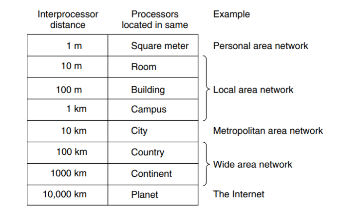
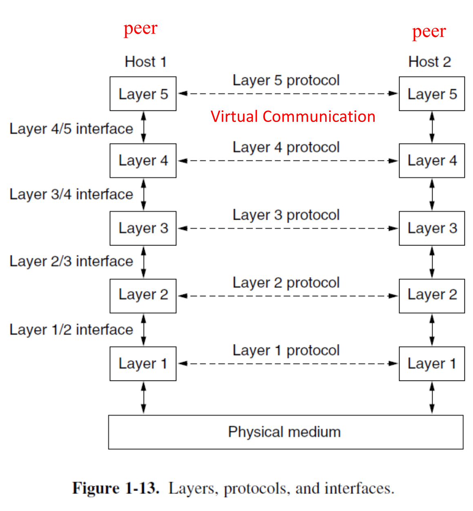
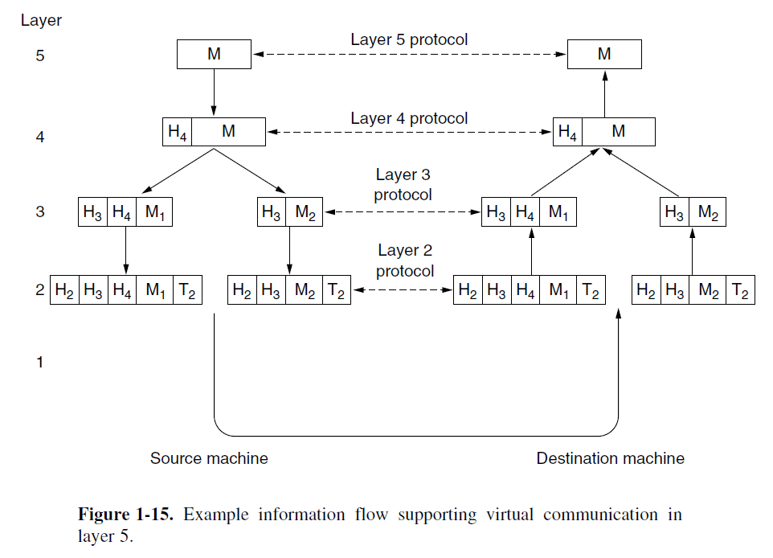
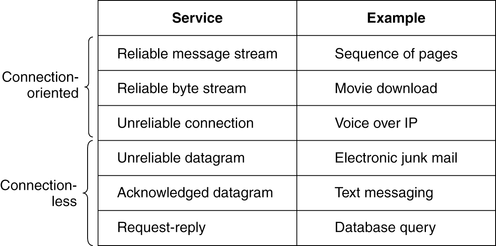
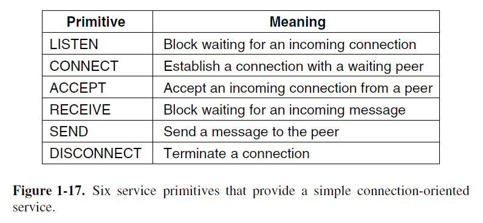
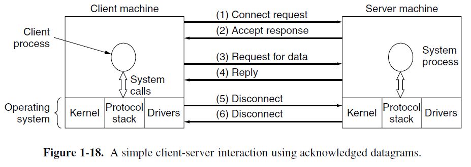
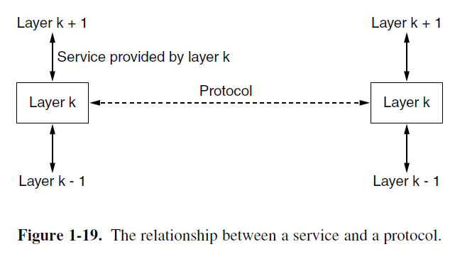
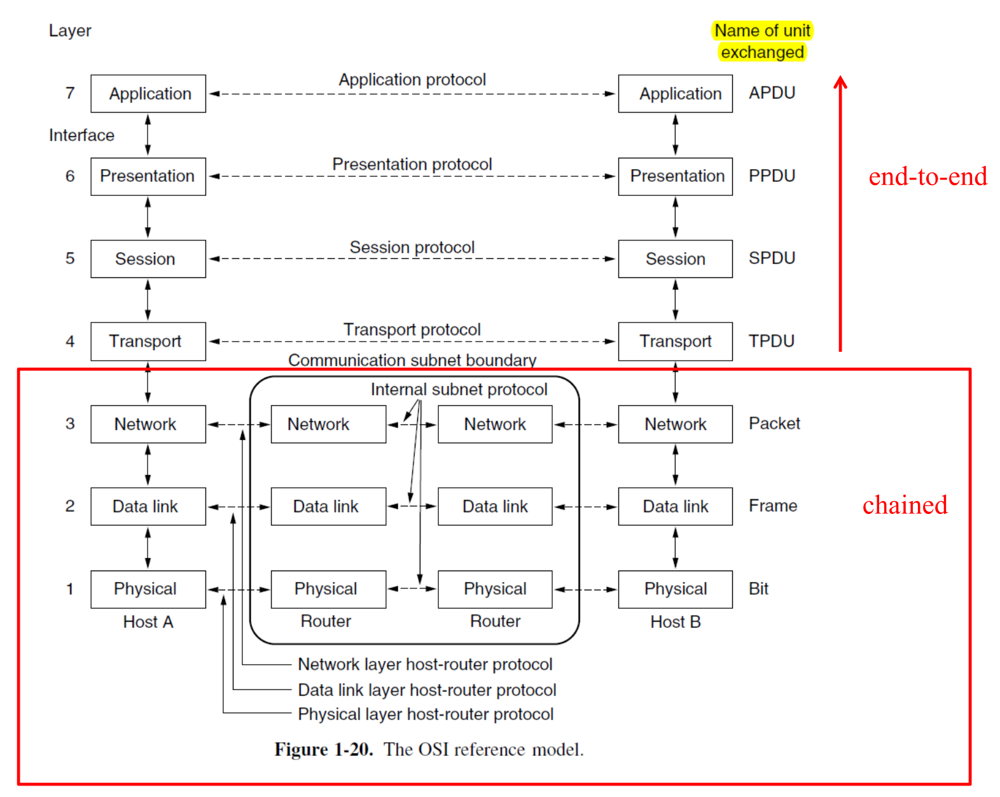
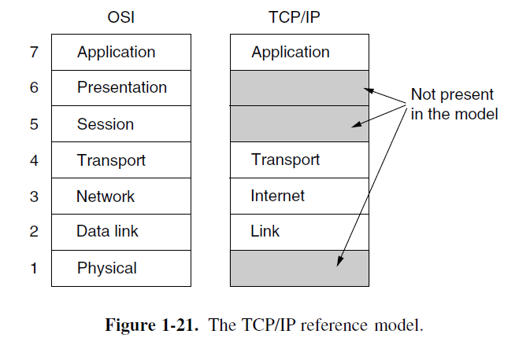
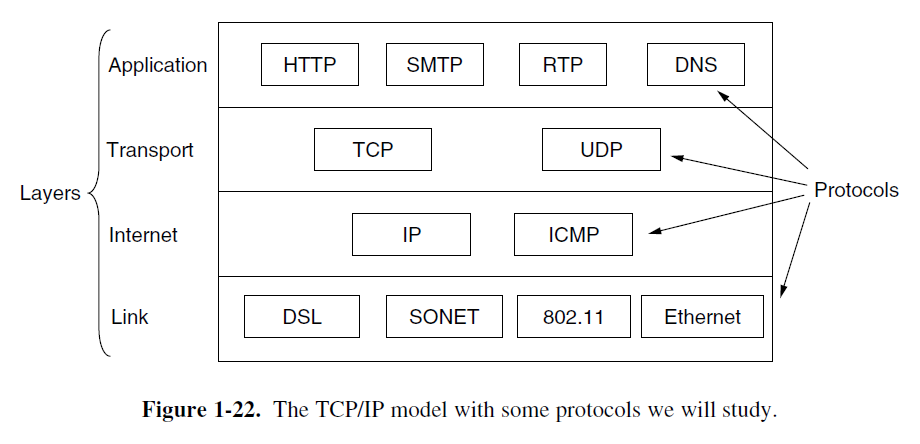

## Network Technology: from local to global

所有计算机网络都可以从两个最重要的维度进行分类： **传播技术** 与 **规模**

* **传输技术 (Transmission Technology)**
    * **广播链路 (Broadcast Links)**: 所有设备共享一个通信信道，任何一台机器发送的数据包都会被所有其他机器接收。数据包通过唯一的 **地址 (Address)** 字段来指定接收方。这种操作模式被称为 **广播（Broadcasting）** ，一些广播系统还支持向机器的一个子集进行传输，这被称为 **多播（Multicasting）**。
    * **点对点链路 (Point-to-Point Links)**: 连接单个成对的机器。数据包从源到目的地可能需要经过多个中间节点转发，因此 **路由算法 (Routing Algorithm)** 在此技术中至关重要。 只有一个发送方和一个接收方的点对点传输有时被称为 **单播（Unicasting）**。

* **规模 (Scale)**

    网络根据其覆盖的物理距离分为不同类型，从个人局域网 (PAN)、局域网 (LAN)、城域网 (MAN) 到广域网 (WAN) 和最终的互联网 (The Internet)。不同的物理距离尺度下，会使用不同的网络技术。



（下面内容需要进一步补充）

* PAN： let devices communicate over the range of a person. Bluetooth
* LAN
* MAN(Metropolitan Area Network): 有线电视网络，802.16（WiMax）
* WAN：ISP，VPN，蜂窝移动网络
* Internetworks

## Examples of Networks

1. **互联网 (The Internet)**

      * 起源于1969年的**ARPANET**，其设计初衷是为了在军事攻击下仍能保持通信，因此采用了分布式结构，以保证**冗余性 (Redundancy)**。
      * 互联网基于**包交换 (Packet Switching)**。每个数据包 (Packet) 被独立路由，即使部分路由器失效，系统也能动态地重新配置路径，保证了网络的鲁棒性。
      * 经历了 ARPANET 到 NSFNET，再到商业化的演进。期间诞生了众多关键技术，如**DNS**、**WWW** 和 **HTTP协议** 。
      * 呈现出从早期的严格层级结构（Tier-1/Tier-2 ISP）向更扁平化的结构演变。家庭接入方式主要有光纤 (Fiber to the Home, FTTH)、DSL 和有线电视网络 (Cable)。

2. **移动网络 (Mobile Networks)**

      * 移动网络最稀缺的资源是 **无线电频谱 (Radio Spectrum)** 。为了最大化利用有限的频谱，移动网络采用了 **蜂窝网络 (Cellular Network)** 的设计。
          * **蜂窝概念 (Cellular Concept)**：1947年由贝尔实验室提出的，将地理区域划分为多个六边形小区 (Cell)
          * **频率复用（Frequency Reuse）**：相邻小区使用不同频率以避免干扰，而相隔较远的小区则可以 **复用** 相同的频率，从而极大地提升了系统容量。
      * **交换技术**:
          * 早期电话网使用**电路交换 (Circuit Switching)**，通信前必须建立一条专用的端到端连接。
          * 现代4G/5G移动网络的核心网已演变为与互联网一致的**包交换（Packet Switching）**。

3. **无线局域网 (Wireless LANs - WiFi)**

    * **基本原理**: 基于**IEEE 802.11**标准，通常工作在免许可 (unlicensed)的ISM频段。（你也不想让帽子叔叔找你吧）
    * **网络结构**: 常见的是基础设施模式，客户端设备通过一个 **接入点 (Access Point, AP)** 连接到有线网络。AP的角色类似于移动网络中的基站 。
    * **挑战**:
        * **多径衰落 (Multipath Fading)** 问题，即信号通过不同路径（反射）到达接收端，可能因相位不同而相互抵消或增强，导致信号强度剧烈波动。WiFi采用 **正交频分复用（OFDM）** 和 **多输入多输出（MIMO）** 来解决多径衰落。
        * 作为广播网络，多设备同时传输会产生**冲突 (Collision)**。WiFi采用**CSMA (载波侦听多路访问)** 机制来处理此问题，其思想源于早期的ALOHA网络。

## Network Protocols / Network Software

### **设计目标 (Design Goals)**

* **Reliability**: 通过错误检测与纠正、路由算法等方式，在不可靠的组件上构建可靠的网络。
* **Resource Allocation**: 如何公平有效地共享有限的网络资源，涉及流量控制 (Flow Control) 和拥塞控制 (Congestion Control)。
    * 使用 **统计多路复用  (Statistical Multiplexing)** 技术提高链路利用率
    > 核心观念：*网络中的数据传输是“突发性”的，大多数用户不会在同一时刻满负荷发送数据。* 因此，网络允许多个用户共享同一条链路，谁有数据就谁用。
    * 使用流量控制防止快速发送方用数据压垮慢速接收方。
* **Evolvability**: 网络能够持续发展和集成新技术。
    * 使用 **分层 (Protocol Layering)** 来支持新技术集成：将一个大的总问题分割为用多个层各自解决的子问题，然后在各自的协议层上进行改进，对其他层隐藏具体的实现细节。
    > 比如我把最底层中使用的传数据的电话线都换成光纤，但是传来的比特数据还是一样的。因为层与层之间只通过 定义明确 且 稳定 的接口进行通信，也就是说别的层只关心接口返回的数据，不在乎你怎么来的
* **Security**: 保护网络免受攻击。

### Protocol Hierarchies

* 核心思想 - **分层 (Protocol Layering)**
  
    将复杂的网络功能划分为一系列有序的层次，每一层都建立在下层之上，并为上层提供服务。
  
* 对等层之间虚拟通信:

    不同主机上的 **对等层 (Peers)** 之间使用 **协议（Protocol）** 来进行相互通信（layer n 之间使用 layer n protocol），这种通信是逻辑意义上的虚拟通信（下图中的虚线）

    实际的数据交流是通过两个主机间的物理介质。实际的数据流是垂直的。数据自顶向下穿过协议栈直到最底部的 Layer 1。Layer 1 之下则是传输实际信息的物理介质。

!!! note

    **Protocol** 定义了两个或多个通信实体之间所交换消息的格式与顺序，以及在发送和/或接收消息或其它事件时所采取的行动。（*A protocol defines the **format** and the **order** of messages exchanged between two or more communication entities, as well as the **actions** taken on the transmission and/or receipt of a message or other event.*）

    **Network architecture**: a set of layers and protocols
      
    **Protocol stack**: a list of the protocols used by a certain system, one protocol per layer
    
    应该可以认为 Protocol stack 是 Network architecture 的具体实现？

* 上下层之间接口通讯：
  
    同一个主机上的相邻层之间使用 **接口（Interfaces）** 来实现服务，传递信息。

!!! note

    **Interface** 定义了 下层 提供给 对上层可用的 运算与服务（*The interface defines which **primitive operations** and **services** the lower layer makes availableto the upper one.*）。



* **数据封装与打包（Encapsulation and Decapsulation）**
  
    当应用程序发送数据自顶向下穿过协议栈时，每一层都会添加自己的控制信息（报头 Header），有时还有报尾（Trailer），这个过程称为封装 (Encapsulation)。 同理，应用数据接受数据是自底向上的，每一层都会根据已有的报头或报尾进行 解包（Decapsulation），然后传给更高一层。如此直到获得最终的数据。



??? example "数据封装的实例"

    举个例子，假如我现在要上睿站。现在我和阿姨的服务器完成了TCP三次握手和TLS握手；协议栈用 TCP/IP 五层模型（也就是下面提到的课上使用的模型，正好对应上面的图）为例（应用层 Layer 5、传输层 L4、网络层 L3、数据链路层 L2、物理层 L1）。

    总的来说，就是发送 HTTP 请求（拿首页），浏览器发出的请求数据自顶向下封装，然后从电脑 → 服务器

    * L5 应用层，也就是你的浏览器发的明文内容差不多长这样：

        ``` http
        GET / HTTP/1.1
        Host: <www.bilibili.com>
        User-Agent: ...
        Accept: ...
        ```

        这时的数据为数据 (Data) 或 报文 (Message)。（上图里 L5 对应的 M）

    * L4 传输层（TCP）

        TCP协议会给HTTP报文加上一个 **TCP头部 (TCP Header)** （上图里 L4 对应的 H4）。加上 TCP 头部的数据块叫做 报文段（Segment）。（上图中包含 L4 与 M 的整个块）

    * L3 网络层（IP）

        由于网络设备的 **最大传输单元（MTU）** 有限，网络层需要将从传输层接收到的数据流分割成一个个大小合适的数据段，这是 **分片 (Fragmentation)**。

        然后，网络层通过 IP 协议给每个块加上各自的 IP头部 （上图 L3 中两个块各自拥有的 H3，这两个 H3 大部分内容相同，但也有为了区分不同数据包而做出差异的信息），最终形成多个数据段。加上IP头部的数据块被称为 **数据包 (Packet)**。

    * L2 链路层（以太网）

        以太网协议给 IP数据包 加上 帧头 (Header) 和 帧尾 (Trailer)（上图 L2 中两个块各自的 H2 与 L2）。这个最终的包装被称为 **帧 (Frame)**。

        帧头（以太网头）包含控制信息，如**源和目的地的MAC地址**。

        帧尾用来进行错误检测，其中的核心字段就是 FCS (Frame Check Sequence)。

    * L1 物理层：比特流发送

        一个典型报文在网卡上长这样：

        ```plaintext
        [以太网头][IP头][TCP头][TLS 记录头][HTTP 请求密文负载][FCS]
        ```

### 两种服务 Connection-Oriented / Connectionless Service

网络中的任何一层都可以选择为它的上层提供两种截然不同的服务模式：

1. **面向连接 (connection-oriented)**: 在传输数据**之前**，必须先建立一个专用的逻辑连接。（类似打电话）
2. **无连接 (connectionless)**: 不需要预先建立连接，可以直接发送数据。（类似邮政系统）

---

#### 面向连接的服务 (Connection-Oriented Service)

先“拨号”建立连接，然后双方“通话”传输数据，最后“挂断”释放连接。这是一个严格的、有序的过程。

**工作流程（以打电话为例）：**

1. **建立连接 (Establish a connection)**:
    * 你拿起电话，拨打对方号码。
    * 网络（电信系统）会为你找到一条通往对方的路径，并发出“振铃”信号。
    * 对方接起电话，此时一条专用的通话线路（逻辑上的）就建立好了。
2. **使用连接 (Use the connection)**:
    * 你们开始对话。你说的话会按照你说话的顺序，不多不少、不重复地传到对方耳朵里。整个通话过程都使用这条预先建立好的线路。
3. **释放连接 (Release the connection)**:
    * 通话结束，任何一方挂断电话。
    * 这条通话线路被拆除，网络资源被释放，可以给其他人使用。

实际例子，高可靠性的应用：文件传输、网页浏览 (FTP/HTTP):

---

#### 无连接服务 (Connectionless Service)

每个数据单元（packet）都像一封独立的信件，有自己的“地址”，然后直接扔进“邮筒”。它们被独立处理和投递。

工作流程（以寄明信片为例）：

* 你写了三张明信片给同一个人。
* 你把它们分别贴上邮票和地址，在不同时间扔进邮筒。
* 邮政系统会独立处理每一张明信片。它们可能会经过不同的城市、不同的分拣中心。
* **结果**：这三张明信片可能会**乱序到达**，甚至某一张**可能在路上丢失了**，而且邮局**不会**通知你。

两种发送方式：

=== "存储转发 (Store-and-forward switching)"
    * 路由器必须读完整个数据包才会开始发送
    * 可以在转发前检查数据包完整性，可靠性更高。
    * 速度慢，因为必须等待接收完整个数据包。
=== "直通交换 (Cut-through switching)"
    * 路由器一旦读取到数据包头部的目标地址，就立刻开始向目标端口转发数据，即使整个数据包还没接收完。
    * 延迟低，速度快。
    * 如果数据包的后半部分有错误，它也已经把错误的数据转发给下一站了。

实际例子，要求**快速响应和低延迟**的应用：

首先就是**打游戏**: 你在游戏中的位置、动作等信息需要尽快发送给服务器。使用无连接服务（如 **UDP协议**），每个数据包都独立发送。

**DNS查询**: 向DNS服务器查询一个网址对应的IP地址。这是一个简单的“问-答”过程（**Request-reply service**），用无连接服务效率最高。

---

!!! note "面向连接是否一定可靠？无连接是否一定不可靠？"
    **不对**。 “面向连接/无连接”和“可靠/不可靠”是两个可以组合的属性。**是否可靠与是否面向连接没有必然关系**。

    1. Reliable 的面向连接服务 (Reliable connection-oriented service) 分为两个主要类别：**message sequences (消息序列)**: 保持消息的边界。比如你发送了两个独立的文件，接收方会收到两个完整、独立的文件；以及 **byte stream (字节流)**: 不保留消息边界，只看作一连串的字节。**TCP** 就是字节流服务，它不在乎你调用了多少次发送函数，只把所有数据看作一个连续的流。

    2. Unreliable 的无连接服务 (Unreliable connectionless service) 被称为 **数据报服务 (Datagram service)**。

    3. 无连接服务也可是 Reliable 的，这被称为 **有确认的数据报服务 (Acknowledged datagram service)**。比如发短信。

    4. 面向连接的服务也可能 Unreliable ，比如 oopz，teamspeak，微信电话里面的 VoIP（语音传输协议）。在这里不能以 Transit delay 为代价用于验证数据。

    

---

!!! tip "为什么有人会用不可靠通信"

    这里翻了下教材的话。

    > “使用不可靠通信”这个概念起初可能会令人困惑。毕竟，为什么会有人宁愿选择不可靠通信，而非可靠通信呢？
    >
    > 首先，在某个特定的层级，可靠通信（也就是我们所说的带确认机制的通信）本身可能就无法提供。例如，以太网就不提供可靠的通信，数据包在传输过程中偶尔会受损。这个问题需要由更高层级的协议来解决。具体来说，**许多可靠的服务，其实就是构建于不可靠的数据报服务之上的**。
    >
    > 其次，提供可靠服务所带来的固有延迟，可能是无法接受的，尤其是在多媒体这类实时应用中。
    >
    > 基于这些原因，可靠与不可靠的通信方式是并存的。

!!! note "总结与对比表格"
    
    | 特性 | 面向连接的服务 (Connection-Oriented) | 无连接的服务 (Connectionless) |
    | :--- | :--- | :--- |
    | **需要建立连接吗？** | **是** | **否** |
    | **数据路径** | 所有数据沿同一条预定路径传输 | 每个数据包独立选路，路径可能不同 |
    | **数据顺序** | **保证按序到达** | **不保证顺序** |
    | **可靠性** | 通常是可靠的（如TCP），有纠错和重传机制 | 通常是不可靠的（如UDP），“尽力而为” |

### 服务原语 Service Primitives

服务是由一组可供用户进程访问该服务的原语（primitive，即操作）来正式定义的。这些原语指示服务执行某个动作，或报告某个由对等实体（peer entity）所执行的动作。

如果协议栈位于操作系统内（通常情况如此），那么这些原语通常就是系统调用（system call）。

这些调用会触发一次陷入内核模式的操作，随即将机器的控制权转交给操作系统，由操作系统来发送必要的数据包。





为什么需要这种看似复杂的面向连接服务？因为在真实的网络环境中，存在消息过大、传输错误、数据包丢失和乱序等问题。简单的无连接服务无法处理这些复杂情况，而面向连接的服务通过建立和管理连接，能够提供一个可靠、有序的数据流，从而确保通信的完整性和正确性。

### 服务与协议的区别 Services vs. Protocols

* **服务 (Service)**: 定义了**下层为上层提供的功能**。它是一种**垂直**关系，发生在同一台计算机的相邻层之间。
* **协议 (Protocol)**: 实现服务的规则集合。它是一种**水平**关系，是不同计算机上 **对等实体 (peer entities)** 之间通信的约定。
* 实体(Entity)使用**协议**来实现它们定义的**服务**。只要对上层提供的服务不变，底层的协议可以自由更改。

> 例如，服务可以看作是 OOP 里面的一个对象，而协议是其中的一个具体的函数实现。



## Reference Models

将分层思想标准化，形成了两种主要的参考模型。

### **OSI参考模型 (7层)**

* 理论上完善的de jure，并未在实践中完全实现。
* 分层结构: 应用层、表示层、会话层、传输层、网络层、数据链路层、物理层。
* 数据单元在不同层次有不同名称，如比特 (Bit)、帧 (Frame)、包 (Packet)，再往上就直接叫各自的 Data Unit。
* **关于 Communication/Internel subnet bondary**:
  * 传输层 (Layer 4) 及以上是真正的**端到端 (end-to-end)** 层
    * 整条线路是通信两端的主机进程构成的两点一线。
    * 这些层中的有关协议，例如 TCP：端口、序号、ACK、重传、流量/拥塞控制、TLS 加密等状态都 **只在两端维护** ，中间的路由器不会来凑热闹。
    * 因此路径怎么绕、经过多少路由器都不影响“这条传输连接”的逻辑，它是一条端到端的会话。
  * 网络层 (Layer 3) 及以下是 **链式 (chained)** 的，数据包需要经过中间路由器逐跳处理。
    * L3 IP 报文要在每一跳被路由器查看并做决定：查表（Forwading Table）选下一跳、把 TTL/Hop Limit 减 1（类似于一个“过期时间”，减到 0 时直接丢弃），可能做分片或丢弃。
    * L2（以太网/Wi‑Fi…）只在一段物理链路内有效：每跳一次，旧的帧被拆掉，换成下一段链路的帧。例如说，MAC 地址换成“本路由器出接口的源 MAC + 下一跳的目的 MAC”；并重新计算FCS。
    * L1 只是把比特在该段介质上发出去。
    * 所以从源到目的其实是由很多“邻接关系”首尾相接的链，**每一段都要本地处理一次**。
* **它不是一个 Internet Architecture，因为它不指定每一层使用什么样的服务和协议**



### **TCP/IP参考模型 (4层)** （内容需要进一步补充）

* 互联网实际使用的de facto。其协议先于模型出现。
* 分层结构: 应用层、传输层、网络层 (Internet)、链路层。
* TCP/IP模型省略了OSI的会话层和表示层，其链路层对应OSI的物理层和数据链路层。
* 每个层次都包含一系列核心协议，如应用层的HTTP/DNS，传输层的TCP/UDP，网络层的IP/ICMP等





> 为了教学方便，课程采用一个综合的五层模型：**物理层、链路层、网络层、传输层、应用层**。

## Standardizations

比较重要的：

1. 802.3 Ethernet
2. 802.11 Wireless LANs (WiFi)
3. 802.15 PANs (蓝牙，Zigbee)

## Quantitative Metrics

从工程角度量化网络性能的关键指标：

* **时延 (Delay)**: 数据从一端到另一端所需的时间，由四部分组成：
    1. **处理时延 (Processing Delay)**: 路由器检查包头的时间。
    2. **排队时延 (Queuing Delay)**: 在路由器缓存中等待的时间。取决于
    3. **传输时延 (Transmission Delay / Store-and-forward Delay)**: 将整个包推送到链路上的时间 ($\frac{\text{包长度 }L}{\text{带宽 }R}$)。
    4. **传播时延 (Propagation Delay)**: 信号在物理介质中传播的时间 (距离 / 传播速度)。

* **丢包 (Loss)**: 当路由器队列满时，新到达的包会被丢弃。

* **吞吐量 (Throughput)**: 单位时间内成功传输的数据量。**由整个路径上带宽最低的“瓶颈链路” (bottleneck link) 决定**。

### Some History

The history of the Internet (ARPANET(1969) → NSFNET(1986) →
Internet)

* Leonard Kleinrock (Packet switching, 1961-1964)
* Ray Tomlinson (第一个email软件, 1972)
* Vinton Cerf and Robert Khan (TCP/IP, 1974)
* Tim Berners-Lee (万维网, 1989)
* Marc Andreessen (Mosaic浏览器, 1993)
