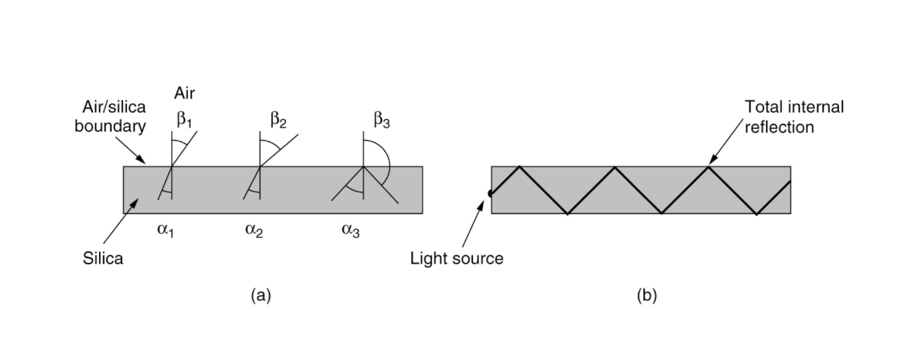
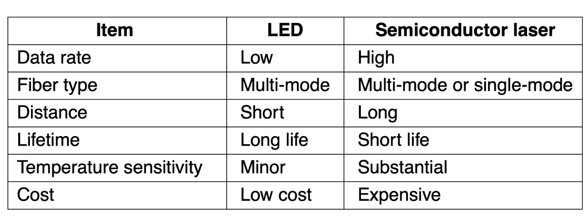

# 1 Physical Layer

## 一些术语

**全双工（full-duplex）**的链路是可以双向同时使用的；

**半双工（half-duplex）**的链路是可以双向使用，但一次只能使用一个方向的；

**单工（simplex）**的链路是只允许一个方向上的流量通过的；

## Transmission Media

### Guided

依赖于物理电缆或者线路的传输介质就是导向的传输介质（Guided Transmission Media）。因为在这些介质上，信号传输实际上是沿着 **物理线路的路径** ，因此是有导向的，

!!! tips "永远不要低估一辆满载着磁带在高速公路上飞驰的旅行车的带宽"
    Persistent Storage 实际上也可以视为一种 Guided Media。它的数据传输方式就是很直白的三步走：

    1. 数据拷贝到存储设备上
    2. 运输存储设备
    3. 数据从存储设备读取到目标计算机
    
    这种运输方式实际上**物理带宽极大**，对于要传输极其庞大的数据集，几乎只能使用这种方法。（实际上第一张黑洞照片数据就是这样传的）。但是，它的**延迟特性很差**，因为其传输时间是按照数小时，数天甚至数个月计。

??? tips "电线传输信号？"

    确实在用，比如电力公司用电线进行低速率通信，比如远程抄表（电表计费）。现代电力线传输已能在多数住宅内提供数十到数百 Mbps 的吞吐。

    但是有以下问题：

    1. 家用电线最初为 50/60 Hz 供电设计，并非为数据通信优化。传输高频数据信号的损耗与辐射更显著
    2. 家用电线中存在的瞬态电流（当电器开关时产生）会产生宽频谱的电噪声。
    3. 同时，电线的电气特性也会随着家用电器的开关而变化，网络的性能在不同房屋之间的差异也很大，而且会随着电器的使用而动态变化。（性能高度依赖具体布线与干扰环境）
    4. 由于电线缺乏屏蔽和平衡传输结构（不同于双绞线传输电压差作为信号），电力线就像一个天线，既会接收外部电磁干扰，也会向外辐射信号。因此，还必须避开业余无线电频段等受保护的频率，以满足监管要求。

#### Twisted Pair

双绞线是一对相互绝缘的铜线，以螺旋状缠绕在一起组成的线缆。它是最便宜且最常用的有线传输介质之一。

1. 工作原理：
   
    <u>两根铜线缠在一起，可以相互抵消彼此产生的波，从而显著降低电线的辐射。</u>信号以这两根线所传输的 **电压差** 传播，从而抵抗外部噪声（因为外部噪声对两根电线的影响几乎是相同的）

2. 应用：它既可以传输 Analog Signal，也可以传输 Digital Signal。
   
    双绞线已被电话网络使用了超过一百年。在计算机网络中，双绞线已被广泛应用于局域网（LANs）内部。数字用户线路技术（Digital Subscriber Line, DSL）利用现有的双绞线在住宅中提供互联网接入，速率可达数十 Mbps。

3. 性能：其带宽取决于导线的直径以及传输的距离。

    使用双绞线的局域网的数据速率范围通常为 10 Mbps至10 Gbps

4. 分类：

    

    - **Category 5e** 线：当前最常见的线缆。一条这样的线缆中有四对扭在一起的双绞线，将多根导线缠在一起的同时保护了双绞线。
     
        在不同的 LAN 标准中对双绞线的使用一般不同。
        
        Fast Ethernet 的 100BASE-TX（最常见的 Fast Ethernet 铜缆标准）使用了四对双绞线中的两对，一对专用于发送，另一专用于接收（半双工）；
        
        而 Gigabit Ethernet 的 1000BASE-T（千兆以太网在双绞线上的标准）使用了全部的四对双绞线，且在每一对上同时收发数据（物理层做回声/串扰抵消），实际只支持全双工。

    - Category 5,6,7 线：新类别电缆具有更严格的规范，可以处理具有更大带宽的信号。

        以上这些线缆都是 **非屏蔽双绞线（Unshielded Twisted Pair, UDP）**，因为它们只是简单的由导线和绝缘层构成。

    - **Category 7** 线：在每对双绞线和整个电缆外部都增加了屏蔽（Shielding），以进一步减少外部干扰和内部其他线路的串扰。这种线缆叫做 **SDP**

    - Category 8 线：比上述线路都更快，但是只能运行在大概 30m 内的短距内，因此只适合数据中心使用。

#### Coaxial Cable

1. 工作原理

    同轴电缆包含两个同心导体 (concentric conductors)，而非平行导体。它由一个坚硬的铜线核心 (stiff copper wire core) 组成，核心被绝缘材料包裹。绝缘体外部是一层圆柱形导体，通常是紧密编织的网状物。最外层是保护性塑料护套。

2. 应用

    - 被广泛用于**有线电视系统 (cable television systems)**。
    - 同轴电缆与电缆调制解调器（cable modems）结合，用于向住宅用户提供互联网接入。这种系统通常被称为**混合光纤同轴 (Hybrid Fiber Coax, HFC) 系统**。在 HFC 架构中， <u>光纤连接有线电视前端（cable head end）到社区级别的接合点，然后使用传统的同轴电缆连接到各个家庭和公寓。</u>
    - 在引入光纤之前，同轴电缆曾被广泛用于电话系统中的长途线路，但现在在长距离干线中已基本被光纤取代。
    - **城域网**中同轴电缆仍然被广泛使用

3. 性能

    - 带宽很大，现代电缆能达到 6GHz 的带宽。
    - 由于其结构和屏蔽，同轴电缆具有良好的屏蔽性和优秀的抗噪声能力。它的屏蔽性优于非屏蔽双绞线。
    - 同轴电缆是一种 **共享广播介质 (shared broadcast medium)**。这意味着它可以同时传输许多个会话。但是，如果多个用户同时下载或上传，每个用户获得的实际速率将由于带宽竞争和冲突而显著低于电缆的总速率。

4. 分类：同轴电缆通常根据其特性阻抗进行分类，这与其主要用途有关

    - 50 欧姆电缆：通常用于数字传输
    - 75 欧姆电缆：通常用于模拟传输和有线电视。

#### Fiber Optics

1. 工作原理

    光纤是一种纤细、柔韧的介质，通过传导光脉冲来传输数据，其中每个光脉冲代表一个比特。

     - 基本机制：光传输系统包含三个关键组件：光源、传输介质和检测器。通常，光的脉冲代表 1 比特，光的缺失代表 0 比特。

      

     - 全内反射：光纤的传输依赖于全内反射（Total internal reflection）。光纤的核心是玻璃纤芯，周围是折射率较低的玻璃包层。当光线以超过某一临界角的角度射到纤芯/包层边界时，光线会被反射回纤芯内，从而被困在光纤中传播数公里而几乎没有损耗。

     - 光源与检测：光纤的发送端通常使用 LED 或半导体激光器 （semiconductor diodes）作为光源。接收端由光电二极管（photodiode）组成，当光线照射到它时会产生电脉冲，并将光信号转换回电信号。

    ??? tips "LED 与 半导体激光器作为光源的区别"

        

     - 色散处理：光脉冲在光纤中传播时会沿长度方向展开，称为色度色散（chromatic dispersion）。通过将脉冲塑造成特殊的形状（称为孤子，solitons），可以抵消色散效应，使脉冲传播数千公里而没有明显的形状失真。

2. 应用

    - 光纤是**首选的长距离有线传输介质**。超过一定距离的所有固定数据通信都应该使用光纤。
    - 高速 Internet 接入，比如 **光纤到户 (Fiber To The Home, FTTH)** 技术：将光纤路径直接延伸到住户家中，提供每秒千兆比特范围的互联网接入速率。
    - 混合光纤同轴 (HFC)：在有线电视系统中，光纤用于连接有线电视前端到社区节点，然后通过同轴电缆连接到各个家庭。（见同轴电缆的应用）
    - 高速 LAN

3. 性能

    - 高速率：
        - 单根光纤能够支持极高的比特率，高达每秒数十甚至数百千兆比特。光纤本身的理论带宽潜力超过 50 Tbps。
    - 低衰减：光纤的信号衰减非常低，在 100 公里以内信号衰减极小。
    - 抗干扰与安全性：
        - **完全免疫**电磁干扰。
        - **难以窃听**，因为光纤不会泄漏光线，且很难被物理窃听。
    - 局限性：
        - 发射器、接收器和交换机等**光纤接口和设备的成本相对较高**，这阻碍了它们在短途传输（如 LAN 或家庭接入网络）中的部署。
        - 这些设备进行电光信号转换的速度也作为目前的主要的技术限制（大约 100 Gbps），导致光纤通信的速度远低于理论上限。
        - 光纤技术**对弯曲敏感，容易受损**。
        - 由于**光传输本质上是单向传输**，因此双向传输要求使用两根光纤，或者在一根光纤上划分两个频段。

4. 分类
   
    由于任何入射角大于临界角的光束都会在光纤内部发生全内反射，而临界角主要取决于纤芯和包层的折射率差，<u>当光纤纤芯直径较大时，会有多种不同的光束以不同的角度向前反复反射传播，形成多个传播模式。</u>但是，<u>如果光纤纤芯直径足够小，小到与光波长可比拟时，只能支持单一传播模式</u>，由此有**多模光纤**和**单模光纤**之分。

    - 多模光纤（Multimode fiber）：直径一般是 50 um。光线以多种模式（不同角度，不同传播路径）在光纤内传播。通常用于较短的距离，成本相对较低，耦合容易
    - 单模光纤（Single-mode fiber）：纤芯直径极小（一般为 8~10 um ），光线像波导一样以单一路径传播。更昂贵，广泛用于长距离传输。

### Wireless

### Satellite

## Theoretical Basis Of Data Transmission

### Fourier Series

!!! tips "具体的数学证明或者运算不重要。只需要记住两点：任何复杂的信号都可以被看作是由许多个不同频率的正弦波叠加而成的；这些不同频率的正弦波被称为谐波。"

**任何复杂的信号都可以被看作是由许多个简单的正弦波叠加而成的。** 这个叠加的总和就是傅里叶级数：

$$
f(x) = \frac12c + \sum_{n=1}^{\infty} \left( a_n \sin\left[2\pi (nf)t\right] + b_n \cos\left[2\pi (nf)t\right] \right)
$$

在这个级数中，每一个正弦/余弦波就是一个傅里叶分量，它们是构成原始信号的基本“积木”。

$f = \frac1T$ 就是 **基频 (Fundamental Frequency)**，它决定了信号的总体重复周期。

$a_n$ 与 $b_n$ 称作第 $n$ 个 **谐波（Harmonic）** 的正弦与余弦的振幅。谐波就是频率为基频整数倍的分量（1倍，2倍、3倍、4倍……）。（注意我在上面的公式将 $nf$ 用括号括起来来强调这一性质）

$c$ 是一个常数

所以，**信号中的傅里叶分量代表了构成该信号的所有不同频率的正弦波成分**。傅里叶级数中的系数（$a_n$， $b_n$）则指明了每个频率成分所占的“比重”或振幅。

### Bandwidth-Limited Signals

我们已经知道了所有信号都可以通过傅里叶分析，以各种不同频率的正弦波作为傅里叶分量，组成一个很近似的信号。但是，现实中的信道（channels）会以不同程度影响不同频率的信号。

如果介质只是一视同仁地削弱所有频率的信号，最终 dst 接受到的信号也就只是振幅变小。但是，实际上几乎所有的介质，对不同频率的信号都有不同的削弱作用，这会导致最终的信号 **失真**。

不过，幸运的是，对一种介质，它都会有一个从 0 开始的频率范围 $0\text{Hz} \sim f_c$，至少在这个范围内的振幅大部分都能衰减极小地传输。如果高于 $f_c$，就会被严重衰减。

??? note "关于高阶的傅里叶分量？"

    一般来说，我们只需要找到一个 $f_c$ 足够的介质，能把我们想要的信号用有限个傅里叶分量很好的拟合出来，就可以达到任务了。更高阶的频率，由于 **傅里叶系数随着 $n$ 增大而减小**，其实际上的影响非常有限。

    不过对于一些特定的信号（例如，完美方波或极窄脉冲），高阶分量虽然振幅小，但它们对于**锐利的边缘**和**信号的上升/下降时间**至关重要。见下面使用不同数量的谐波，传递比特 01100010 的信号图，黑色、红色与蓝色的曲线各自使用了8, 15 与 200个谐波：

    

$0\text{Hz} \sim f_c$ 这个能够无强烈衰减地传输的频率范围宽度被称为 **带宽（Bandwidth）**。在实践中，截止过程并非是突然发生的，**因此通常所说的带宽是指从 0 到接收功率下降一半时的那个频率。** 。 $f_c$ 也叫 **截止频率（Cutoff Frequency）**

### The Maximum Data Rate of a Channel

Nyquist Formula:

Shannon Theorm: 设信噪比为 $SNR$，则 $=B\log_2(1+SNR)$

### 

## Digital Modulation and Multiplexing

### Baseband Transmission

### Passband Transmission

### Digital Modulation

我们已经知道，通带传输需要用0和1去改变载波。一个标准的正弦波载波有三个可变参数：Amplitude，Frequency 与 Phase 。因此，有以下基本的调制方法：

- 幅移键控 ASK：幅度取不同离散值（如 2 电平、4 电平 ……）。
  - 容易受干扰。比如信号在传输中衰减了，高振幅可能被误认为低振幅。
- 频移键控 FSK：频率取不同离散值（早期调制解调器、低速无线）。
- 相移键控 PSK：相位取不同离散值（BPSK、QPSK、8PSK）。
  - BPSK：规定一个“标准”的波形起点，发送 "1" 时，就按这个标准波形发送；发送 "0" 时，把波形翻转180度再发送。
  - QPSK：使用 4 个 不同的相位来表示信息。这四个相位通常是相隔 $90\degree$ 的。（然后类比8PSK（更快但抗噪声能力更差）？）
- 正交振幅调制 QAM：**幅度+相位**联合离散化（16/64/256‑QAM 等）。
  - QAM-16：使用 16 个 不同的符号状态来表示信息。每个符号状态结合了不同的相位和幅度值。一个符号代表 4 个比特信息（从 $0000$ 到 $1111$ 共 16 种组合）。（4G LTE,802.11）
  - QAM-64：使用 64 个 不同的符号状态来表示信息。每符号承载 $\log_264=6$ 比特。具有非常高的频谱效率，但由于符号点数量更多，相邻符号点之间的距离更近（见下图 Figure 2.23(c)），因此它对信道条件（如信噪比）的要求非常高，抗干扰能力较弱。

!!! note "一些小坑点"
    - “数字调制 = 数字波形？” 实际上传的是连续的电/电磁/光波形；“数字”指离散的符号集合与判决过程。
    - “更高阶调制一定更好？” 不，受 SNR/线性度限制，链路差时反而要降阶保证 BER。
    - “带宽和速率是一回事？” 不是。带宽（Hz）是资源上限；能用到多少速率要看调制、SNR、编码和实现。

### Frequency Division Multiplexing

### Time Division Multiplexing

### Code Division Multiplexing

## Examples of 