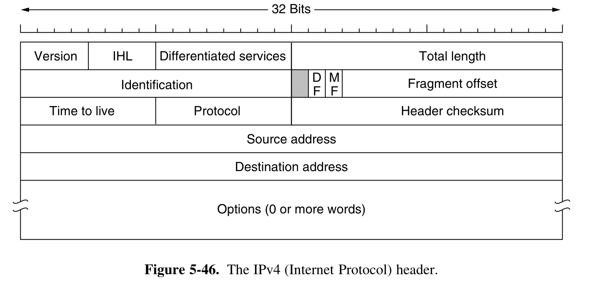
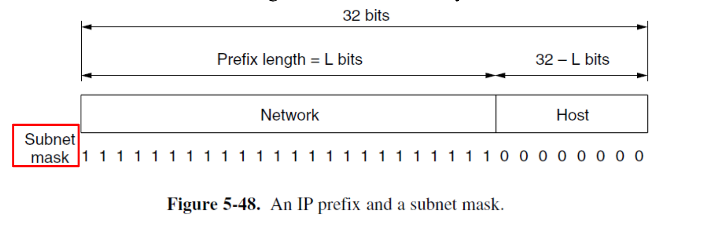

# 4 Network Layer

## Routing Algorithm

### Flooding

### Distanced-Vector algorithm

每个路由器维护一个距离向量（路由表），其中包含到网络中所有其他路由器的已知距离（成本）。路由器定期与它的直接邻居交换这些信息。

它的核心思想有点像“听邻居说”：

- 我不知道网络的全局拓扑。
- 我只相信我的邻居告诉我的信息。我的邻居会告诉我“我到某某地方需要多少成本”。
- 我结合自己到这个邻居的成本，就能算出我通过这个邻居到达目标的总成本。
- 我会从所有邻居给我的信息中，为每个目的地选择一个成本最低的路径。

这个算法的经典例子是 RIP (Routing Information Protocol)。它的问题是可能会遇到“计数到无穷”问题，导致收敛缓慢。

### Linked-State algorithm

与 DV 算法中每个节点只了解邻居不同，在 LS 算法中，每个路由器都力求构建出整个网络的完整拓扑图。

它的工作方式更像是“全局地图”：

1.  **发现邻居**：路由器启动时，首先了解它的直接邻居和到这些邻居的链路成本。
2.  **广播状态**：每个路由器将自己的“链路状态”（我是谁，我的邻居是谁，到邻居的成本是多少）广播给网络中的所有其他路由器。
3.  **构建拓扑**：每个路由器收集来自所有其他路由器的链路状态信息，最终在本地构建出整个网络的完整地图。
4.  **计算最短路径**：一旦地图构建完成，每个路由器就使用像 Dijkstra 这样的算法，在本地计算出自己到所有其他路由器的最短路径。

这个算法的代表是 OSPF (Open Shortest Path First)。它比 DV 算法收敛更快，且不容易产生路由环路，但对路由器内存和 CPU 的要求更高。

## IP Protocol

IP (Internet Protocol) 是网络层的核心协议，它的主要任务就是“寻址”和“转发”。你可以把它想象成全球邮政系统，负责把你的信（数据包）从一个地址送到另一个地址，但不保证一定送到，也不保证按顺序送到。

### IPv4

IPv4 数据报的头部是**可变长度**的。它有一个 20 字节的**固定部分**（或称主首部）和最大 40 字节的**可选部分**（选项和填充）。因此，首部总长度在 20 到 60 字节之间。

以下是 IPv4 数据报首部中各关键字段的详细结构和功能：

| 字段名称（中文） | 字段名称（英文） | 位数 | 描述 | 备注 |
| :--- | :--- | :--- | :--- | :--- |
| **版本号** | Version Number (VER) | 4 | 指定 IP 协议的版本，IPv4 中值为 4。 | |
| **首部长度** | Header Length (HLEN/**IHL**) | 4 | 定义数据报首部总长度，单位是 32 位字（4 字节）。**最小值为 5，即 20 字节。** | IP 头里有个沟槽的 `Options` 段随地大小变导致头部长短不一，所以需要这个来定义位置。 |
| **服务类型** | Type of Service (TOS) /Differentiated Services | 8 | 用于区分不同类型的 IP 数据报，显式拥塞通知。 | 前 6 位用于标记数据包的服务类型，后 2 位携带显式拥塞通知信息 |
| **数据报总长度** | Datagram Length /Total Length | 16 | 定义 IP 数据报（首部 + 数据）的总长度，以字节为单位。最大理论长度为 65,535 字节。 | |
| **标识** | Identification | 16 | 与分片相关，用于标识原始数据报的所有分片。 | |
| **标志** | Flags | 3 | 第一位没用，第二位是 DF（Don't Fragment），第三位是 MF (More Fragments)| 010 没有分片，自身完整数据；001 自己是分片；000 是分片的最后一部分 |
| **片偏移** | Fragmentation Offset | 13 | 与分片相关，指示该分片在原始数据报数据部分中的起始位置（以 8 字节为单位）。 | **不算 header，只算其中分段的有效数据在原来完整有效数据中的位置偏移** |
| **生存时间** | Time-to-live (TTL) | 8 | 防止数据报在网络中永久循环。每经过一个路由器减 1，若减至 0 则丢弃数据报 | 防止有些数据明明传不过去了还赖着不死，浪费资源 |
| **协议** | Protocol | 8 | 指示数据报有效载荷应递交给哪个上层传输层协议。例如，6 - TCP，17 - UDP。 | 类似于传输层的端口号，用于将网络层与传输层绑定。 |
| **首部校验和** | Header Checksum | 16 | 用于检测首部中是否存在位错误。由于 TTL 等字段会在每跳路由时改变，校验和必须在每个路由器上重新计算。计算校验和时，将首部中的每个 2 字节视为一个数字，使用 1 的补码算术求和，然后将结果的 1 的补码存储在校验和字段中。 | **IPv4 比较懒，只校验头部对不对**。至于数据坏没坏，它觉得那是 TCP 和 UDP 该操心的事。 |
| **源 IP 地址** | Source IP Address | 32 | 发送数据报的主机的 IP 地址。 | |
| **目的 IP 地址** | Destination IP Address | 32 | 最终目的主机的 IP 地址。 | |
| **选项** | Options | 0-40 字节 | 可变长度的可选字段，用于网络测试和调试。 | **过时技术，几乎被禁用或忽略**。最大限制为 40 字节，以确保 IP 首部长度不超过 60 字节。 |

#### Fragmentation

### IPv4 Addressing

#### Address Format

IPv4 使用 **32 位** 的地址，使用 **点分十进制表示法(Dotted Decimal Notation)** 表示，其中 每 8 位被分别写成共 4 个十进制数，各自用小数点分割。

!!! attention "注意一个 IP 地址并不真正代表一个主机，而是一个网络接口。因此如果一个主机接入了两个不同的网络，它应该有两个 IP 地址。尽管绝大多数主机都在单一网络中，因此只有一个 IP 地址。而连接不同网络的路由器由于有多个接口，因此就有多个 IP 地址"

比如，如果一个十六进制地址是 `80D00297` ，由于 `0x80=128`，`0xD0=208`，`0x02=2`，`0x97=151`，因此对应的表示就是 `128.208.2.151`

IP 地址是以地址块的形式被分配的，这样的块在地址中以前缀的形式存在。一个唯一的前缀代表唯一的网络号，例如如果设 `128.208.2.151` 的前 24 位视作该前缀，那么前面的 `128.208.2 -> 0x80D002` 代表了它所在的网络，而后 8 位 `151 -> 0x97` 代表了它在这个网络中作为主机的编号。

但是，我们该如何知道哪些部分是表示网络号的前缀，哪些又是表示其余主机号的部分呢？实际上，如果不特地标注，我们肯定不会知道。这就是为什么路由协议不仅需要存储地址，还要专门标注它们的前缀长度。

在上面的例子里 我们设 `128.208.2.151` 的前 24 位视作该前缀，所以它完整的记法就是 **`128.208.2.151/24`** 。这说明它的前 24 位才代表了它所在的网络。当然，我们可以通过将其与 24 个 1 和 8 个 0 组成数进行 AND 运算得到它的前 24 位，这不就是掩码操作吗！所以掩码也可以表示这个前缀，此时这个掩码就叫做 **子网掩码**。子网掩码也使用点分十进制表示，24 个 1 和 8 个 0 就是 `0xFFFFFF00`，对应的记法就是 `255.255.255.0`

在实际网络工程或考试中，我们经常需要处理两个问题：
1.  将 `/x` 转换为点分十进制掩码。
2.  给定一个 IP 和 `/x`，计算出它所在的**网络地址**、**广播地址**以及**可用主机范围**。

##### 将前缀长度转换为点分十进制掩码

子网掩码由连续的 $1$ 和后续的 $0$ 组成。我们要做的就是把 `/x` 切分成 4 个 8 位组。总的来说就是 **每满 8 位就是一个 255，然后算剩下的余数。**

具体步骤如下：

1.  $x / 8 = $  满额的 `255` 的个数。
2.  $x \% 8 = $ 余数（即在下一个字节中前缀 1 的个数）。
3.  根据余数计算该字节的值（从高位开始加）：

!!! example "将 `/26` 转换为子网掩码"
    1.  $26 \div 8 = 3$ 余 $2$。
    2.  前 3 个字节全是 255：`255.255.255.x`。
    3.  第 4 个字节是前两位为 1，计算 `11000000` 得 **192**。
    4.  结果：`255.255.255.192`。

##### 计算网络地址与范围

**核心公式：**

-   **主机位长度** $h = 32 - x$
-   **总 IP 数** = $2^h$
-   **块大小 (Block Size)** = $256 - \text{掩码中非255的那个数}$ （或者在该字节上的 $2^\text{剩余主机位数}$ ）

!!! example  "计算 IP 地址：**`192.168.10.170/26`** 的网络地址与范围"
    1. `/26` 意味着前 24 位（前3个数）固定，变化发生在第 $26 / 8 = 4$ 个字节。
       
       掩码为 `255.255.255.192` (因为 `/26` 模 8 余 2，对应 192)。

    2. 块大小 = $256 - 192 = 2^6= 64$。网络是每 **64** 个数为一组进行划分块的（0, 64, 128, 192...）。

    3. 我们的 IP 第 4 段是 170。 $128\le170<192$ （注意为什么这样判断下面会说），所以，该 IP 属于从 128 开始的那个块。

    然后得出以下结论：

    | 项目 | 计算方法 | 结果 |
    | :--- | :--- | :--- |
    | **网络地址 (Network ID)** | 网络块的第一个地址 | `192.168.10.128` |
    | **广播地址 (Broadcast)** | 这一块的最后一个地址，即下一块的第一个地址 - 1 (192 - 1) | `192.168.10.191` |
    | **可用主机范围** | 网络地址 +1 到 广播地址 -1 | `192.168.10.129` 到 `192.168.10.190` |
    | **可用主机数量** | $2^{(32-26)} - 2 = 2^6 - 2$ | 62 个 |

!!! tip "如果前缀是 `/24` 这种整字节的，计算就非常简单：子网掩码是 `255.255.255.0`，网络号是 `x.x.x.0`，广播是 `x.x.x.255`，同理 `/16` `/8` 也是类似。只有当掩码出现在字节中间（如 `/25`, `/26`, `/27`...）时，才需要使用块大小法。"
    

#### Historical Approach - IP Address Classes (Abandoned)

早年玩网大手子们用的是一套很死板的分类方法。在这种传统的，**已被弃用**的地址分级系统中，地址的类型是由 IP 地址的**起始位**决定的，这同时也决定了默认的子网掩码：

| 地址类别 | 起始位 (二进制) | 范围 (十进制) | 默认子网掩码 | 备注 |
| :--- | :--- | :--- | :--- | :--- |
| **Class A** | **0**XXXXXXX... | `1.0.0.0` - `126.255.255.255` | `/8` (255.0.0.0) | *0.x 和 127.x 被保留* |
| **Class B** | **10**XXXXXX... | `128.0.0.0` - `191.255.255.255` | `/16` (255.255.0.0) | |
| **Class C** | **110**XXXXX... | `192.0.0.0` - `223.255.255.255` | `/24` (255.255.255.0) | |
| **Class D** | **1110**XXXX... | `224.0.0.0` - `239.255.255.255` | **无** | 用于**多播** (Multicast) |
| **Class E** | **1111**XXXX... | `240.0.0.0` - `255.255.255.255` | **无** | 保留实验用 |

在这个系统中，网络部分和主机部分是**固定的**。例如，你拿到一个 `10.x.x.x` 的地址，它就强制是一个 Class A 网络，子网掩码必须是 `/8` (255.0.0.0)，不能更改。

注意表里 Class A 是从 `1.0.0.0` 开始，结束于 `126.255.255.255`；而 Class B 从 `128.0.0.0` 开始。这其中 **`0.x.x.x` 与 `127.x.x.x`** 的地址没有被提到。虽然从二进制位上看，它们属于 A 类（0开头），但通常不列入可用 A 类网络范围：

1.  **`0.0.0.0/8`** (软件分配范围)：
    -   `0.0.0.0`：表示“本网络上的本主机”。常作为源地址（例如 DHCP 请求时，设备还没 IP，就用这个自称）。
    -   作为路由条目时，表示**默认路由**。

2.  **`127.0.0.0/8`** (环回测试 Loopback)：
    -   用于测试本机进程间通信。最常用的是 `127.0.0.1` (localhost)。
    -   如果数据包的目的地址是**环回**地址，它不会被发送到任何网络，而是直接被**环**绕回来送**回**给自己。

3.  尽管这个老登分类方法已经因为自身不太行（比如不好分配网络类别：A 类能放的主机太多太浪费，C 类能放的主机太少不够用，B 类看起来好点结果人人都在要这个导致网络号不够用了等等）被我们前面所用的前缀标识网络号的方法换血了，但 **0.x、127.x、D 类（多播）和 E 类** 的特殊用途仍然赖着不死。

#### Nowadays Standard - CIDR

实际上 CIDR 就是我们前面所讲的前缀标识网络号的方法。大多数 CIDR 的东西我都在上面写过了，不过上面主要讲的是通过前缀划分网络号的 method，在这里我只需要补充几点：

1. CIDR 中地址分配是 **按长度为 2 的幂次的地址块分配** 给组织的，这个地址块的长度取决于 `/x` 的大小（$2^{32-x}$）。你要 1000 个 IP，我就给你划个 `/22`，而不是扔给你一个 Class B）
2. 这个地址块本身也要以块的大小进行对齐。**它的起始地址必须是块大小的整数倍。** 比如你要一个 `/26` 的块（大小为 64），你的起始 IP 只能是 `.0`, `.64`, `.128` 或 `.192`。你不能指着 `192.168.1.10` 说“从这儿开始给我划 64 个地址”。
3. 不管是 CIDR 还是以前的土哥们办法，一个地址块的**第一个地址一定用来代表整个网络，而最后一个地址一定用来给这个网路所有主机发广播**。所以这两个地址都不能留给主机，**主机在一个网络中可用的地址数量永远都是 地址块大小 - 2** 。
4. 前缀当然允许重叠。比如一个路由表里可能有 `10.0.0.0/8`  和 `10.1.1.0/24` ，如果一个数据包要去 `10.1.1.5`，它同时符合这两条规则，路由器该听谁的？
   
   路由器永远选择掩码最长（也就是前缀最具体、范围最小）的那一条路由。因为掩码越长，说明原本的匹配度越精确。在这个例子中，`/24` 比 `/8` 长，所以路由器会走 `/24` 指向的路。这个规则叫做 **最长匹配前缀(Longest Matching Prefix)**

#### Subnetting

子网划分允许我们将一个大的网络块（比如一个 `/16` 的网络）划分成多个更小的网络（子网）。这是通过“借用”主机部分的位来作为子网部分实现的。

这样做的好处是：

-   **管理更灵活**：可以将一个大的机构网络（比如校园网）划分成多个部门的子网，方便管理。
-   **减少广播流量**：广播包只会在子网内部传播，不会影响到其他子网，提高了网络性能。
-   **提高安全性**：可以在子网之间设置防火墙策略。

#### Routing Aggregation / Supernetting

路由聚合是子网划分的逆过程。它将多个小的、连续的网络块合并成一个大的网络块来向外界通告。

例如，一个 ISP 可能拥有从 `200.23.16.0/24` 到 `200.23.31.0/24` 的 16 个连续的 C 类网络。如果没有路由聚合，它需要向互联网广播 16 条路由信息。

通过路由聚合，它可以将这 16 个 `/24` 的网络聚合成一个 `/20` 的网络 `200.23.16.0/20`，然后只向外界广播这一条路由信息。

这极大地减小了全局路由表的规模，减轻了路由器的负担。

#### NAT

NAT (Network Address Translation) 是一种在 IP 地址耗尽危机中广泛使用的技术。它允许一个局域网（LAN）内的多台主机共享一个或少数几个公共 IP 地址来访问互联网。

我们家里或学校的路由器就是一个典型的 NAT 设备。

-   **私有 IP 地址**：在局域网内部，每台设备（手机、电脑）都被分配一个私有 IP 地址（例如 `192.168.1.x`）。这些地址是可重用的，不同局域网可以使用相同的私有地址。
-   **公共 IP 地址**：路由器本身有一个由 ISP 分配的、全球唯一的公共 IP 地址。

当内部的一台主机（比如 `192.168.1.100`）想要访问外部服务器（比如 `google.com`）时：

1.  数据包从主机发送到路由器。源 IP 是 `192.168.1.100`。
2.  路由器修改数据包的源 IP 地址，换成它自己的公共 IP 地址。同时，它会选择一个新的源端口号，并在内部的 NAT 转换表中记录下这个映射关系（`私有IP:私有端口` <-> `公共IP:新端口`）。
3.  数据包被发送到互联网上。
4.  当 `google.com` 的响应包回来时，它会到达路由器的公共 IP 地址和那个新端口号。
5.  路由器查找 NAT 转换表，根据端口号找到对应的内部主机 `192.168.1.100`，然后再次修改数据包的目标 IP 和目标端口，将其转发给内部主机。

通过这种方式，整个局域网在外界看来就像一台设备，极大地缓解了 IPv4 地址的短缺问题。

### IPv6

## Control Protocols

### ICMP

### ARP

IP 在网络层被路由器用来找路，但 Data Link Layer 层（以太网/Wi‑Fi）真正发帧时必须知道对方的二层地址（MAC）。网卡只认 MAC，不认 IP。因此，需要一个将 IP addr 映射到 MAC addr 的方法。在 IPv4 中常用的就是 ARP。

它的简单工作流程如下：

1. 首先判断是同一网段通信还是跨网段通信。如果是同一网段，就直接找目标主机的 MAC，如果不是，就找自己默认网关的 MAC。
2. 对于下一跳的 MAC 地址，当前主机会先查本机 ARP 缓存表，如果有则直接用上面的内容。
3. 如果没有，就根据 IP 地址广播一个 ARP query packet：Who has AbaAbaAba, tell BalaBalaBala “谁是那谁谁谁，你把你地址给我交了”。
   
    

    - 上图代表 wireshark 中一个实际的 ARP packet
    - 这个 packet 的 **以太网帧** 有一个特殊的目标 MAC 地址： **FF:FF:FF:FF:FF:FF** ，代表这是一个广播包。交换机 / 网卡就是根据这个地址决定：这个帧要转发 / 递交给所有人
    - 这个 packet 的 ARP **payload** 的目标 MAC 地址是 **00:00:00:00:00:00**，因为 ARP query 本来就表示“我想知道那台主机的 MAC 地址是什么”，但现在还不知道，所以写全 0。实际上这个字段在这里也是无意义的，在实现中也全填 0。
  
4. 目标主机/网关 收到这个 ARP query 后，把自己的 MAC 回复过去（ARP response）
5. 原主机收到 ARP response 后，先把收到的 MAC 地址记到 ARP 缓存里，然后再把原来的包发出来，在后面一段时间内这个 MAC 地址会一直在表里，后续直接用。

!!! note "IPv6 不用 ARP，用的是邻居发现协议（NDP，基于 ICMPv6），但是本质用途相同，都是将 IP 映射为 Data Link Layer 的地址"

### DHCP

DHCP (Dynamic Host Configuration Protocol) 是一种让我们“即插即用”上网的协议。如果没有 DHCP，我们每台设备连网时都需要手动配置 IP 地址、子网掩码、默认网关和 DNS 服务器，这显然非常麻烦。

DHCP 实现了网络配置的自动化。当你将设备连接到网络时，会发生一个四步过程，通常缩写为 **DORA**：

1.  **Discover**: 你的设备（DHCP 客户端）在网络中广播一个 DHCP Discover 消息，大喊一声：“嘿！这里有 DHCP 服务器吗？我需要一个 IP 地址！”
2.  **Offer**: 网络中的 DHCP 服务器收到消息后，会回复一个 DHCP Offer 消息，说：“你好，我这里有一个 IP 地址 `192.168.1.101` 你可以用，还有这些配置信息（网关、DNS等）。” 这个消息也是广播的（或者在某些情况下是单播的）。
3.  **Request**: 客户端可能会收到多个 Offer。它会选择一个（通常是第一个收到的），然后再次广播一个 DHCP Request 消息，告诉所有服务器：“谢谢大家，我决定用 `192.168.1.101` 这个地址了。” 这也是为了通知其他提供了 Offer 的服务器，它们的地址可以收回给别人用了。
4.  **Acknowledge**: 被选中的 DHCP 服务器会回复一个 DHCP Acknowledge (ACK) 消息，确认这次租约：“好的，`192.168.1.101` 从现在起就归你了，租期是 X 小时。”

完成这四步后，你的设备就获得了 IP 地址和所有必要的网络配置，可以开始上网了。

## Routing Protocols

为了理解数据如何在不同网络和系统之间路由，首先得在 Network Layer 的 Perspective 中分析整个 Internet 是什么样的。

如果我们将 Internet 的结构再抽象一层：

自治系统（AS, Autonomous System）：由一个组织统一运营、**使用统一路由策略**的 IP 网络集合。

一个自治系统 (AS) 通常对应着：

- 一个大型的互联网服务提供商 (ISP)。

- 一个大型的云服务提供商 (如 AWS, Google Cloud)。

- 一个大型的企业或学术机构网络。

比如：中国电信一个 AS、Google 一个 AS、浙江大学一个 AS

整个 Internet 可以看成若干万级别的 AS，按一定拓扑连接在一起。

为了将不同的 AS 相互连接，一个 AS 内一个（或多个）路由器会有额外的将 packet 转发到本 AS 以外的目的地的工作。这些路由器就是 **Gateway routers**.

### Routing Information Protocol

RIP 是一个 distanced-vector protocol，它更多用于较低级的 ISP。

### Open Shortest Path First

更多用于更高级的 ISP，它是一个 link-state protocol

### BGP

与在单个 AS 内进行路由的 RIP 和 OSPF 不同， BGP 是一个 **inter-AS** routing protocol。

它也是一种 基于 DV routing algorithm 的变体 的 protocol，它基于一种特殊的策略，而并非简单的最短路径。

> BGP is a form of distance vector routing protocol *based on policies rather than on minimum distance*

---

## 我家 gpt 给我的阅读建议 

先按你的**考试大纲 + 将来做网络游戏开发**两个目标一起帮你“裁剪” Chapter 5。

整体优先级（按重要性排序）：

1. **必读、会考的核心：**  
   - 5.1（除少量细节）  
   - 5.2（Routing Algorithms，前 9 小节）  
   - 5.4 里关于 **MPLS** 的部分  
   - 5.5 里关于 **分片/AS** 的部分  
   - 5.7 中的 **IPv4/IPv6、子网与聚合、NAT、DHCP、ICMP/ARP 等控制协议、RIP/OSPF/BGP**

2. **考试不太考，但对网络游戏开发有帮助：**  
   - 5.3 Traffic Management  
   - 5.4 里 QoS/QoE、流量整形、调度等内容

3. **基本可以放到考后：**  
   - 5.6 SDN  
   - 5.8 Policies  

下面按小节详细说：哪些精读、哪些略读、哪些可以先不看。

---

### 5.1 Network Layer Design Issues

**和大纲对应：**  
- “Two main functions of the network layer: Forwarding & Routing”  
- “Connectionless services and Connection-oriented services（Datagrams vs Virtual-Circuits）”

建议：

- **5.1 整体：建议都看一遍，但抓重点，不用抠太细。**

重点内容：
- **精读：**
  - 5.1.2 Services Provided to the Transport Layer  
    - 要弄清楚：  
      - Connectionless service ↔ Datagram subnet  
      - Connection-oriented service ↔ Virtual-circuit subnet  
    - 能用自己的话解释“无连接”和“面向连接”的区别。
  - 5.1.3 Implementation of Connectionless Service  
  - 5.1.4 Implementation of Connection-Oriented Service  
  - 5.1.5 Comparison of Virtual-Circuit and Datagram Subnets  
    - 这三小节一起看，最后要能回答：  
      - Datagram 网络和 VC 网络在 **路径选择、路由表、故障恢复、开销** 上的差异。

- **略读：**
  - 5.1.1 Store-and-Forward Packet Switching  
    - 知道路由器是“存储转发”的、转发和路由是什么就行，不用记细节例子。

---

### 5.2 Routing Algorithms

**和大纲高度对应：**  
- Link-state routing & Dijkstra，及可能的 oscillations  
- Distance-vector routing & Bellman-Ford & Count-to-infinity  
- Hierarchical / Broadcast / Multicast / Anycast routing  

这一节是**考试大头，必须精读**。

建议：

- **5.2.1 – 5.2.9：全部精读。**
  - 5.2.1 Optimality Principle  
  - 5.2.2 Shortest Path Routing  
    - 要会走一遍 **Dijkstra 算法** 示例（手算一次），知道它求的是最小代价的路径。
  - 5.2.3 Flooding  
    - 和后面 **Broadcast routing** 是有关联的，考试有时会问泛洪的优缺点。
  - 5.2.4 Distance Vector Routing  
    - **核心：Bellman-Ford 方程** 和 “Count-to-infinity problem”。  
    - 书里的例子建议自己推一遍，理解好坏消息传播的过程。
  - 5.2.5 Link State Routing  
    - 核心流程要清楚：  
      1. 每个路由器发现邻居和链路代价  
      2. 形成链路状态分组，Flooding 全网  
      3. 每个路由器本地跑 Dijkstra  
    - 看一下书里“度量随负载变化导致振荡”的例子（oscillations）。
  - 5.2.6 Hierarchical Routing  
    - 知道为啥要分层、什么是 AS / 区域，路由表如何缩小。
  - 5.2.7 Broadcast Routing  
    - 几种做法：Flooding、基于生成树、反向路径转发（RPF）等，要有概念。
  - 5.2.8 Multicast Routing  
    - 了解组播地址的概念、组成员管理的基本思路（比如依赖 IGMP 等），不用太细。
  - 5.2.9 Anycast Routing  
    - 概念题可能会问：  
      > “What is anycast? How is it different from unicast/multicast?”

- **5.2.10 之后（Routing for Mobile Hosts / Ad Hoc / P2P 等）：**
  - 和大纲无直接匹配，**考试优先级低**。  
  - 对游戏开发（尤其 P2P 游戏、移动端）有一些启发，可以考后或有兴趣时再看。

---

### 5.3 Traffic Management

多半讲的是**拥塞控制、流量管理、抖动控制**之类。

**考试大纲没有单列“拥塞控制/QoS”相关点**，所以这里优先级不高。

建议：

- **整体：考试向 → 可略读；时间紧可以先放一放。**

如果你为了网络游戏开发，建议至少在有空时：
- 看下 5.3.1（什么是拥塞、开放/闭环控制的区别）
- 看下和 **jitter（抖动）控制**、丢包、排队延迟有关的部分  
  这些概念和实时联机游戏的“延迟、卡顿体验”非常相关，但不是本次期末的核心。

---

### 5.4 Quality of Service and QoE

和考试大纲**唯一直接对应的是：MPLS（虚电路型服务的例子）**。

建议分两层来看：

1. **为了考试：**
   - **精读：MPLS 对应的小节（通常是 5.4.7 MPLS 或类似标题）**
     - 要知道：
       - MPLS 用标签转发，逻辑上类似 Virtual Circuit  
       - 怎么和 IP 协作（在 IP 报文前加 Label）、为什么可以加速转发和做 Traffic Engineering。

2. **为了以后做网络游戏：**
   - 这些部分都很值得在考后好好看一遍，当前可**略读**：
     - 5.4.1 QoS Requirements（带宽、延迟、抖动、丢包）  
     - 5.4.2 Traffic Shaping（Leaky bucket / Token bucket）  
     - 5.4.3 Packet Scheduling（FIFO、Priority Queue、WFQ 等）  
     - 5.4.4 Admission Control  
     - 5.4.5/5.4.6 IntServ / DiffServ  
   - 对你以后理解“为什么游戏在某些网络环境下体验差”会有很大帮助，但考试一般不会深挖这些机制。

---

### 5.5 Internetworking

主要是“不同网络怎么连成互联网”，以及**分片（fragmentation）、隧道（tunneling）、AS 概念**等。

和大纲关联：

- 分片、MTU 等算在 “The IP protocol” 的细节里。  
- “Internet routing protocols” 之前，需要对 AS / interior vs exterior routing 有基本概念。

建议：

- **精读：**
  - 5.5.3 Internetwork Routing（如果这里讲到 Autonomous Systems / interior vs exterior，建议看懂）  
  - 5.5.4 Packet Fragmentation  
    - 配合 5.7 里的 IPv4 头部字段一起看。  
    - 很多老师会出“IP 分片计算题”：给出 MTU、原始报文长度，问分成几片；每片的 offset、长度、MF 标志等。

- **略读：**
  - 5.5.1 How Networks Differ  
    - 了解不同网络在帧格式、MTU、 QoS 等方面差异的概念即可。
  - 5.5.2 Tunneling  
    - 知道隧道的大概用途（比如 IPv6 over IPv4）就行，细节非考点。

---

### 5.6 SDN

软件定义网络（SDN）、OpenFlow 等内容。

**大纲没有提 SDN / OpenFlow**，通常这部分是“扩展知识”。

建议：

- **考试：可以不读或很粗略地看一眼。**
  - 最多知道一句话：SDN 把控制平面和数据平面分离，集中控制路由器/交换机的转发表。

- **网络游戏开发：**  
  - 短期内用不到，除非你将来做数据中心/云网络相关工作，可以考后再系统了解。

---

### 5.7 The Network Layer in the Internet

这是和考试最直接相关的一大块，必须重点投入时间。

和大纲一一对应：

- IPv4 / IPv6 地址、子网与聚合、NAT、DHCP  
- IP 协议本身（首部格式、分片等）  
- Internet routing protocols: RIP, OSPF, BGP  
- Internet control protocols: ICMP, DHCP, ARP,（DNP / DNS 一类的）  

建议：

**这一节里要**精读**的内容：**

1. **IPv4 协议本身**
   - 小节名一般类似：*The IPv4 Protocol*  
   - 要会：
     - 画出或在试卷上认出 IPv4 首部格式（Version, IHL, TOS, Total Length, Identification, Flags, Fragment Offset, TTL, Protocol, Header Checksum, Source/Destination Address 等）。  
     - 知道各字段大致用途——尤其是 TTL、Protocol、Identification/Flags/Offset 和分片的关系。

2. **IP 地址 & 子网 / 聚合 / NAT**
   - 小节名一般是 *IPv4 Addresses*, *IP Addressing* 之类。  
   - 里面会包含：
     - 32 位地址、点分十进制表示  
     - 子网掩码、CIDR 前缀（/24, /16 等）  
     - **Subnetting & Aggregation**  
       - 会按前缀划分子网、计算网络地址/广播地址、可用主机数。  
       - 会看一组相邻前缀合并成一个聚合前缀。
     - **NAT**  
       - 静态 NAT / NAPT（端口映射）的基本机制。  
       - 理解“多台内网主机共享一个公网 IP”这件事。  
       - 对你将来做 P2P/联机游戏尤其重要（穿透 NAT 是个大问题）。
     - **DHCP**  
       - 知道它是用来自动分配 IP 的协议、基本交互过程（DISCOVER / OFFER / REQUEST / ACK 的思路）。

3. **Internet control protocols**
   - 小节通常叫 *Internet Control Protocols* 或类似，重点包括：
     - **ICMP**：用于差错报告（Destination Unreachable, Time Exceeded 等）和诊断（ping, traceroute）。  
     - **ARP**：IP 地址 ↔ MAC 地址的解析过程。  
     - **DHCP**：有时在这里详细讲。  
   - 大纲里提的 “DNP” 很可能是打错了，教材里一般会讲 **DNS**，不过严格说 DNS 是应用层。

4. **Internet routing protocols: RIP, OSPF, BGP**
   - 这三者一般在一个大小节里分成三个子小节：
     - **RIP**：  
       - 距离向量协议，度量是 hop count，最大 15 跳。  
       - 周期性更新、收敛慢；和前面 5.2 的 Distance Vector 概念对应。
     - **OSPF**：  
       - 链路状态协议，区域（area）、基于 cost 的度量。  
       - 和前面 5.2 的 Link State Routing 概念对应。
     - **BGP**：  
       - 在自治系统（AS）之间工作的 path-vector 协议。  
       - 关键点是**基于策略**而非只追求最短路径；路由条目里带有 AS-PATH。  
   - 要达到：能简单比较 RIP / OSPF / BGP 的定位与特点。

5. **IPv6**
   - 小节通常叫 *IPv6* 或 *IP Next Generation* 之类。  
   - 要会：
     - IPv6 地址长度 128 位，冒号十六进制表示，压缩规则（连续 0 可用 :: 替代）。  
     - IPv4/IPv6 头部的主要区别（如 IPv6 没有首部校验和、没有分片字段等）。  
     - 大致知道 IPv4 -> IPv6 过渡的思路（双栈、隧道）即可，不用记方案细节。

**可以略读/按兴趣看的内容：**
- Internet Multicast 的实现细节（IGMP、PIM 等），若有单独小节，可只大致了解即可。  
- Mobile IP / 移动 IPv6，如出现在本节后面，可视时间略读。
$2^{\text{剩余主机位}}$）

---

### 5.8 Policies

一般讲网络层的政策问题，比如：
- 网络中立性（net neutrality）  
- 流量监管/计费策略  
- 与运营商策略相关的路由决策等  

大纲没有提到这块内容。

建议：

- **考试：可以不读。**
- 感兴趣可以当课外阅读。

---

### 最后给你一个“复习路线”建议

如果时间有限，可以按这个顺序走：

1. **第一轮（直接对应大纲，必须掌握）：**
      - 5.1：除 5.1.1 外都认真看一遍，搞懂 Datagram vs Virtual Circuit。  
      - 5.2：5.2.1–5.2.9 全部精读，多做几次 Dijkstra、Bellman-Ford 的手算。  
      - 5.4：只精读 MPLS 所在小节。  
      - 5.5：精读 Internetwork Routing 里的 AS 概念 + Packet Fragmentation。  
      - 5.7：  
        - IPv4 协议与首部  
        - IP 地址 / 子网 / CIDR / NAT / DHCP / ARP / ICMP  
        - RIP / OSPF / BGP  
        - IPv6

2. **第二轮（有助于理解、对游戏开发有帮助）：**
      - 5.3 Traffic Management（至少看拥塞、抖动相关段落）  
      - 5.4 里 QoS & QoE、Traffic Shaping、Scheduling 等内容

3. **考后或有空再看：**
      - 5.6 SDN  
      - 5.8 Policies  
      - 5.2 中 Mobile / Ad hoc / P2P 等路由拓展内容（对做 P2P 游戏有启发）